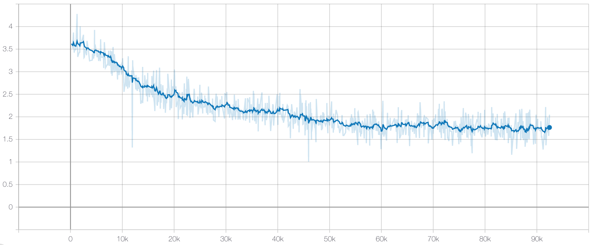

# Music-GPT-2
### Music GPT-2 Implementation with Relative Positional Embedding

This project is an implementation of Music Transformer(https://arxiv.org/abs/1809.04281) using GPT-2.

The GPT-2 source code was used in the link below. 
https://github.com/openai/gpt-2

The difference with the GPT-2 source is that this used only decoder and relative position embedding.

## Pre-requisites
1. tensorflow 1.14
2. numpy
3. librosa
4. tensorboardX
5. tqdm
6. python-midi
https://github.com/louisabraham/python3-midi

## Preprocessing
1. Download and extract Maestro dataset V.2.0.0 from the following link
https://magenta.tensorflow.org/datasets/maestro

2. Run preprocessing.ipynb
Modify daestro_dir into your own maestro dataset path in the file.

## Training

1. Check the data_dirs and load_dir, save_dir. 
data_dirs: the directories to load preprocessed data files 
load_dir: the directory to load model 
save_dir: the directory to save model

2. Run Music-GPT-2.ipynb
you can increase the batch size by changing batch_size variable.

## Inference

Run 'Output MIDI file' cell in Music-GPT-2.ipynb to make a new MIDI file.
You should check load_dir, and variable N means the sequence length of what you want to make. It should be greater than the hyper-parameter n_time.

## Loss

## Samples
Three samples created Music-GPT-2 
https://soundcloud.com/hutenheum/sets/three-musical-moments-by-gpt-2
 

